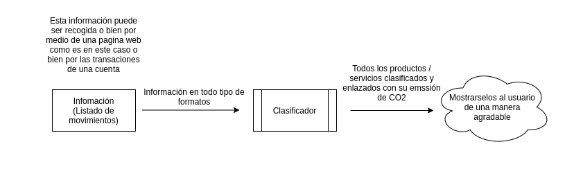
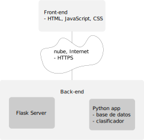
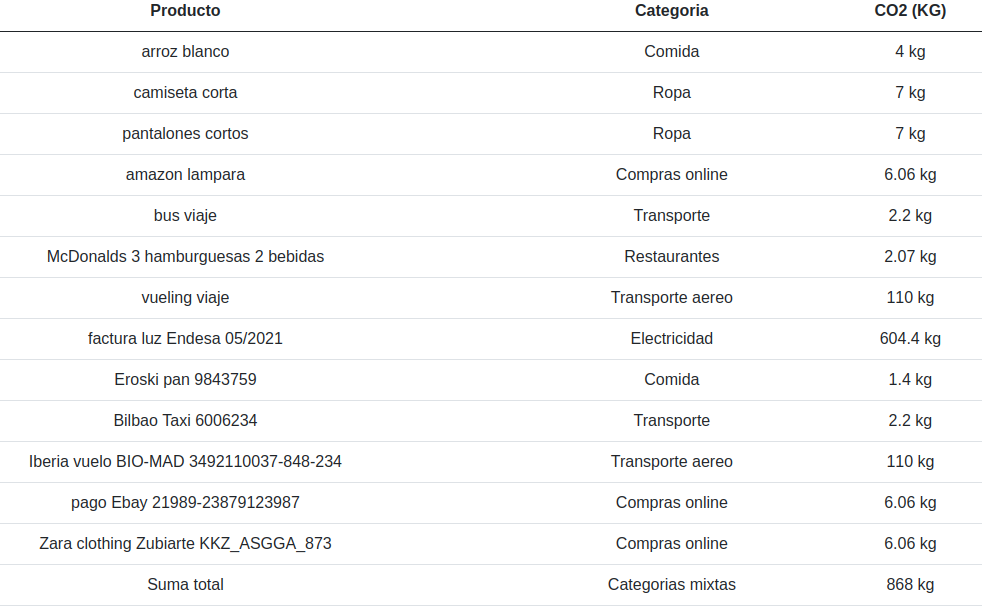
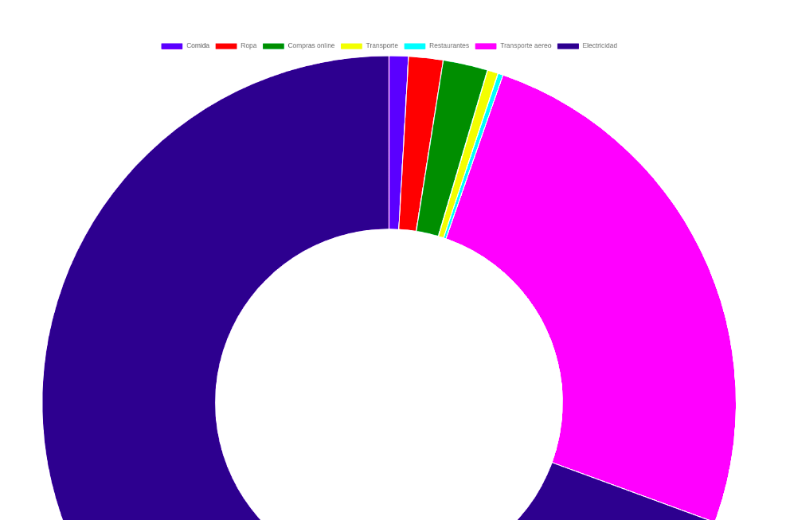

# HACK-DISRUPT-Fintech-Insurtech

I EVENTO HACK &amp; DISRUPT Fintech &amp; Insurtech

Hackathon, 25 a 27 de junio 2021, 25 to 27 of June 2021

Bilbao, Spain

https://international-hackathon.com/hackathons/espana/bilbao/hackdisrupt/
https://app.hopin.com/events/hack-and-disrupt/

Bienvenidos a Hack & Disrupt! El evento que conecta emprendedores para reimaginar las finanzas y los seguros.

Welcome to Hack & Disrupt! The event that connects entrepreneurs to reimagine finance and insurance.

# Reto seleccionado, Chosen challenge: Emisiones de C02

El reto que mas me ha llamado era el reto de calcular la huella de carbono.

- https://es.wikipedia.org/wiki/Huella_de_carbono
- https://en.wikipedia.org/wiki/Carbon_footprint

He llamado mi proyecto Hack-CO2 y he hecho un pequeño logotipo para el proyecto.

# Hack-CO2

## Introducción

Este proyecto es una solución para el problema propuesto por el equipo de Laboral Kutxa. Este último busca una manera para concienciar a sus usuarios sobre las emisiones de CO2 que crean al consumir diferentes servicios y productos.

## Solución

La solución que yo he encontrado para este problema se puede dividir en tres simples pasos:
Recolectar información sobre ciertos productos y servicios conocidos y sus emisiones de CO2 al consumirlos, adquirirlos o usarlos.
Clasificar y filtrar productos que compran los usuarios en varios grupos para poder enlazarlos a la información que hemos recolectado previamente.
Enlazar los productos con sus emisiones y mostrarlos al usuario.

## Implementación

La implementación de esta solución está separada en dos secciones: el `front-end` y el `back-end`.
Para el back-end he creado una simple base de datos juntando muchas 
fuentes de información.  
Después he programado un clasificador que clasifica los productos. 

Este tiene dos niveles:

- Nivel 1: trata de encontrar la emisión exacta del producto
- Nivel 2: en el caso de que no sea posible encontrar la emisión concreta, 
  el clasificador intentará hacer una estimación, usando promedios.

El `front-end` se encarga de mostrar la información de una manera visual al usuario. 
En este caso por fines demostrativos también se encarga de coger una muestra de una factura; 
esto no sería necesario si ya tenemos la información de los productos para los que deseamos calcular la emisión.

## Tecnologías

El front-end está programado con HTML, Javascript y CSS. Por otro lado, el back-end está programado con Python.

## Arquitectura

## Puntos que resaltar

Este tipo de sistema está basado puramente en información. Por esa razón cuanta más información disponible haya más preciso será el clasificador y mejores resultados se obtendrán. En este caso debido a la falta de tiempo la cantidad de información es limitada y aún así los resultados son sorprendentes.

## Demostración

La demostración completa está en un video llamado `demostracion.mp4`. 

También se puede leer en un fichero PDF, [Hack-CO2.pdf](Hack-CO2.pdf). 

Aun así voy a dejar aquí un breve resumen del funcionamiento de mi implementación.

La parte visual de la solución es el front-end, una página web. 
Lo abrimos en un navegador.

Primero de todo pegaremos un ejemplo de un listado de movimientos en una cuenta. 
Los productos pueden tener cualquier formato pero cada producto debe estar separado por una línea nueva. 

### Input

### Resultados, Respuesta

Para calcular las emisiones de C02 de esta factura tendremos que pulsar el botón de calcular y obtendremos estos resultados:

Aquí podremos ver cuántos kg de CO2 produce cada uno de estos productos/servicios. Esta información también está representada en una gráfica:

# Codigo

Todo el código para este proyecto está publicado en Github. https://github.com/Jonny-exe/HACK-DISRUPT-Fintech-Insurtech

# Fuentes de datos, Data sources

- https://carbonfund.org/calculation-methods/
- https://www.conservation.org/carbon-footprint-calculator#/
- https://github.com/lenaromanenko/food_carbon_footprint
- https://github.com/protea-earth/carbon_footprint
- http://css.umich.edu/factsheets/carbon-footprint-factsheet
- https://www.climatekuul.com/
- https://www.kaggle.com/search?q=co2+in%3Adatasets
- https://www.kaggle.com/selfvivek/environment-impact-of-food-production?select=Food_Production.csv

# Instalacion, Installation

Sigue estas instrucciones, Follow these instructions:
- [Instrucciones, Instructions](https://github.com/Jonny-exe/HACK-DISRUPT-Fintech-Insurtech/tree/master/self-host)

:heart: _hack & disrupt !_
